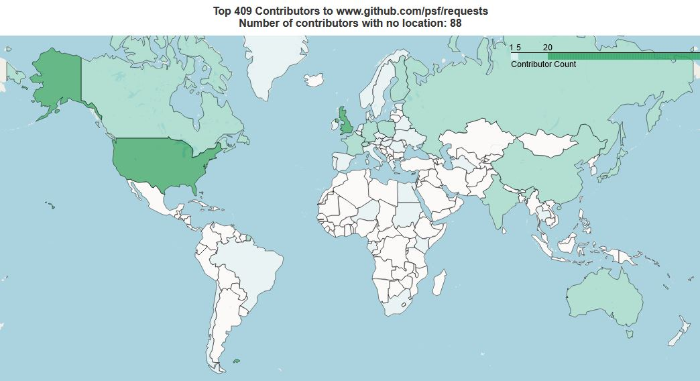

.. image:: https://github.com/IQTLabs/GitGeo/workflows/Python%20package/badge.svg
   :target: https://github.com/IQTLabs/GitGeo/workflows/Python%20package/badge.svg
   :alt: GitHub Actions Unit Tests

.. image:: https://codecov.io/gh/IQTLabs/GitGeo/branch/main/graph/badge.svg?token=W5DVGL0VMN
   :target: https://codecov.io/gh/IQTLabs/GitGeo
   :alt: codecov

.. image:: https://api.codacy.com/project/badge/Grade/5eb7fb4f74b04e83b0ce967a75b460f5
   :target: https://app.codacy.com/gh/IQTLabs/GitGeo?utm_source=github.com&utm_medium=referral&utm_content=IQTLabs/GitGeo&utm_campaign=Badge_Grade
   :alt: Codacy Badge

.. image:: https://mperlet.github.io/pybadge/badges/10.svg
   :target: https://mperlet.github.io/pybadge/badges/10.svg
   :alt: pylint Score

.. image:: https://github.com/IQTLabs/GitGeo/blob/main/badges/python_versions_supported.svg
   :target: https://github.com/IQTLabs/GitGeo/blob/main/badges/python_versions_supported.svg
   :alt: Python Versions Supported

.. image:: https://github.com/IQTLabs/GitGeo/workflows/CodeQL/badge.svg
   :target: https://github.com/IQTLabs/GitGeo/workflows/CodeQL/badge.svg
   :alt: CodeQL

.. image:: https://img.shields.io/badge/security-bandit-yellow.svg
   :target: https://github.com/PyCQA/bandit
   :alt: security: bandit

.. image:: https://img.shields.io/badge/code%20style-black-000000.svg
   :target: https://github.com/psf/black
   :alt: Code style: black

GitGeo
======

Discover the geography of open-source software. Explore the geographic locations of software developers associated with a GitHub repository or a Python (PyPI) package.

See, for instance, the geography of the contributors to the Python package requests.

Why use GitGeo?
---------------

* Curiosity
* Open source software community management
* Research on open source software ecosystems
* IT security compliance

Related Writing
---------------

* `GitGeo Overview Blog <https://www.iqt.org/gitgeo-discover-the-geography-of-open-source-software/>`_
* `GitGeo Applied to Open Source Python Data Science Blog <https://www.iqt.org/the-geography-of-open-source-data-science-mapping-anaconda-code-contributors/>`_

Installation
------------

.. code-block:: bash

   pip install gitgeo
   
Or:

.. code-block:: bash

   git clone https://github.com/IQTLabs/GitGeo

Usage
-----

(requires internet connection)

* 
  First, create one or more `GitHub personal access tokens <https://docs.github.com/en/github/authenticating-to-github/creating-a-personal-access-token>`_.

* 
  Second, run these commands in the command line to set environmental variables:

  .. code-block:: bash

     export GITHUB_USERNAME='[github_username]'
     export GITHUB_TOKEN='[github_token]'

* 
  Alternatively, to use multiple tokens, create a file called tokens.txt in the code's directory and enter
  a GitHub personal access token on each line.

* 
  Third, run these commands in the command line:

``gitgeo --package [package_name]``

``gitgeo --repo [github_repo_url]``

For example:

``>>> gitgeo --package requests``

.. code-block::

   -----------------
   PACKAGE: requests
   -----------------
   CONTRIBUTOR, LOCATION
   * indicates PyPI maintainer
   ---------------------
   kennethreitz42 | Virginia, USA
   Lukasa * | London, England
   sigmavirus24 | Madison, WI
   nateprewitt * | None
   slingamn | None
   BraulioVM | Malaga & Granada, Spain
   dpursehouse | Kawasaki
   jgorset | Oslo, Norway
   ...

Or:

``>>> gitgeo --repo www.github.com/psf/requests``

.. code-block::

   -----------------
   GITHUB REPO: psf/requests
   -----------------
   CONTRIBUTOR, LOCATION
   ---------------------
   kennethreitz42 | Virginia, USA | United States
   Lukasa | London, England | United Kingdom
   sigmavirus24 | Madison, WI | United States
   nateprewitt | None | None
   ...

There are other command line options too:

Add ``--summary`` to get the results summarized by country. e.g.

``>>> gitgeo --package requests --summary``

.. code-block::

   -----------------
   PACKAGE: requests
   GITHUB REPO: psf/requests
   -----------------
   COUNTRY | # OF CONTRIBUTORS
   ---------------------------
   United States 37
   None 23
   United Kingdom 4
   Canada 4
   Germany 4
   Switzerland 4
   Spain 2
   Russia 2
   ...

Add ``--map`` when using the ``--repo`` option to create an html map
saved in the results folder. See image above for static example. Real map
includes zooming and tooltip capability.

Add ``--ouput_csv`` to output csv of results to results folder.

To create a csv of contributors from many repositories, enter repositories
on separate lines in the repos.txt file. Then use the ``--multirepo`` flag.

Add ``multirepo_map`` and then a filename to create a map of csv ouput. csv output must be located in the results folder.

Add ``--num`` and specify a multiple of 100 from 100 (default) to 500 to
specify the number of contributors analyzed per repo.

Run tests:
^^^^^^^^^^

.. code-block:: bash

   pytest

Want to contribute?
-------------------

* Open a PR. We are glad to accept pull requests. We use black and pylint and
  pydocstyle, though we are glad to help if you haven't used those tools before.
* Open an issue. Tell us your problem or a functionality you want.
* Want to help build a community related to GitGeo and similar open source software
  ecosystem exploration tools? Please send an email to jmeyers@iqt.org.
